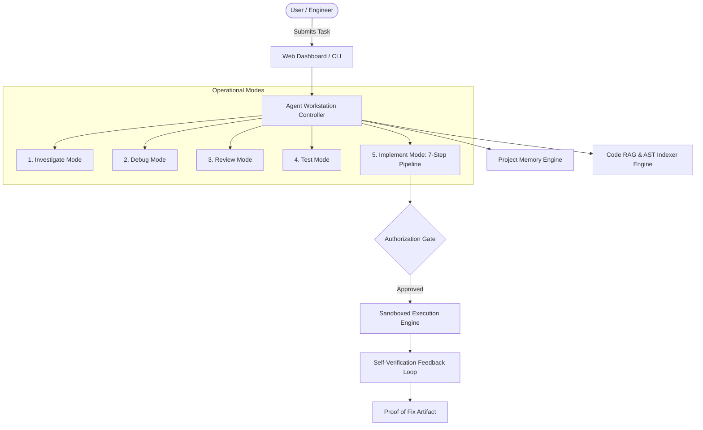

# Junior Dev Agent - AI Software Engineer Workstation

An autonomous, guardrail-enforced AI Software Engineering Agent system that operates inside repositories with strict security boundaries, Code RAG context retrieval, AST repository indexing, persistent project memory, self-verification feedback loops, and 5 operational modes.

## Architecture Overview

---

## 5 Operational Modes

| Mode | Allowed Write Actions | Description |
| :--- | :--- | :--- |
| **Investigate** | ❌ Hard Blocked | Analyzes bugs, traces code flow, and generates Investigation Reports without modifying files. |
| **Debug** | ❌ Hard Blocked | Investigates runtime errors, stack traces, and exception logs to locate failure sites. |
| **Review** | ❌ Hard Blocked | Conducts code/PR reviews assessing security, style, and architectural alignment. |
| **Test** | ✅ Post-Approval | Identifies untested functions/routes and generates unit/integration tests. |
| **Implement** | ✅ Post-Approval | Modifies code following strict 7-step pipeline: `Plan -> Proposed Changes -> Approval -> Apply Patch -> Self-Verification -> Review Diff -> Proof of Fix`. |

---

## Developer Tool Suite

- `search_code`: Semantic Code RAG & regex search across repository index.
- `read_file`: Reads target file contents with line range bounds.
- `list_files`: Lists directory file tree.
- `find_references`: Locates symbol references and call sites via AST graph.
- `search_git_history`: Inspects git log and commit history.
- `run_test`: Runs test suite inside isolated sandbox.
- `run_linter`: Runs linter (flake8/ruff/eslint) inside sandbox.
- `run_type_checker`: Runs type checker (mypy/tsc) inside sandbox.
- `git_diff`: Inspects active working tree diffs.
- `create_patch`: Drafts unified diff for proposed changes.
- `apply_patch`: Applies approved patch to repository files.

---

## Security & Guardrails

1. **Path Boundary Enforcement**: Hard-blocks reads and writes outside the target repository path.
2. **Phase 1 Read-Only Policy**: Mutating tools (`create_patch`, `apply_patch`) raise `PermissionError` until authorized.
3. **Sandboxed Command Execution**: Commands run inside isolated Docker/Subprocess containers with CPU/memory limits, 30s timeouts, and masked environment variables.
4. **Self-Verification Loop**: Fixes are never assumed complete until tests, linters, and type checkers pass in the sandbox.

---

## Command Quick Reference

- Run Web API Server: `python -m app.api.server`
- Run CLI Interface: `python -m app.cli --mode implement --repo ./demo_repo/auth_app --task "Fix logout on refresh"`
- Run Test Suite: `pytest`
